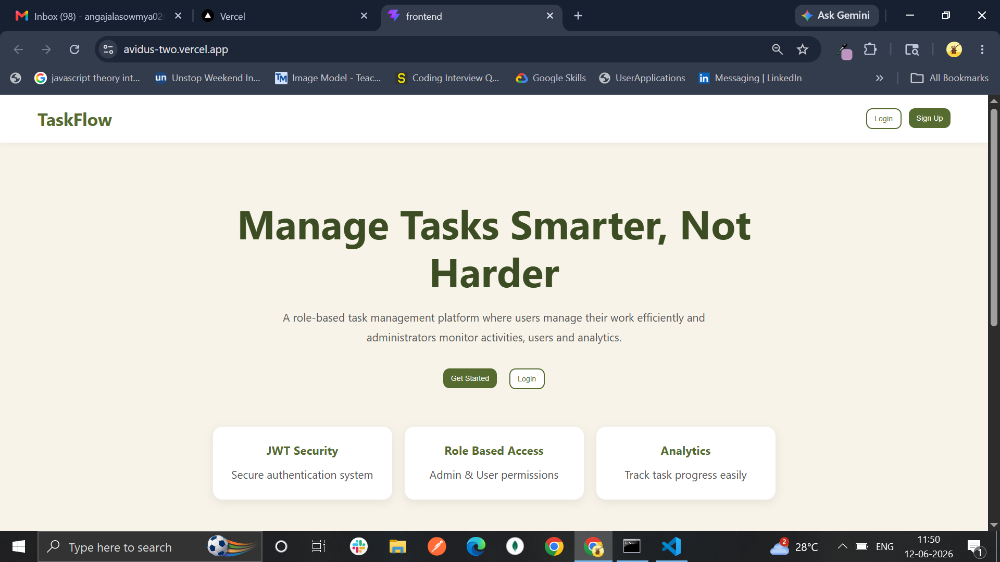
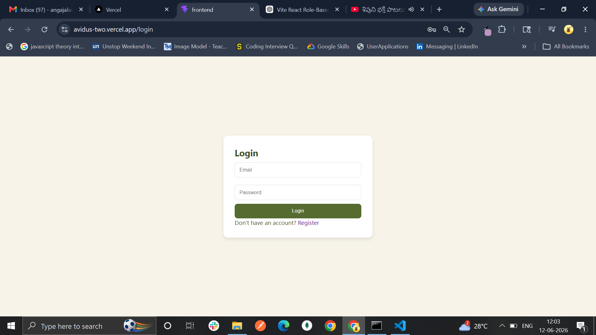
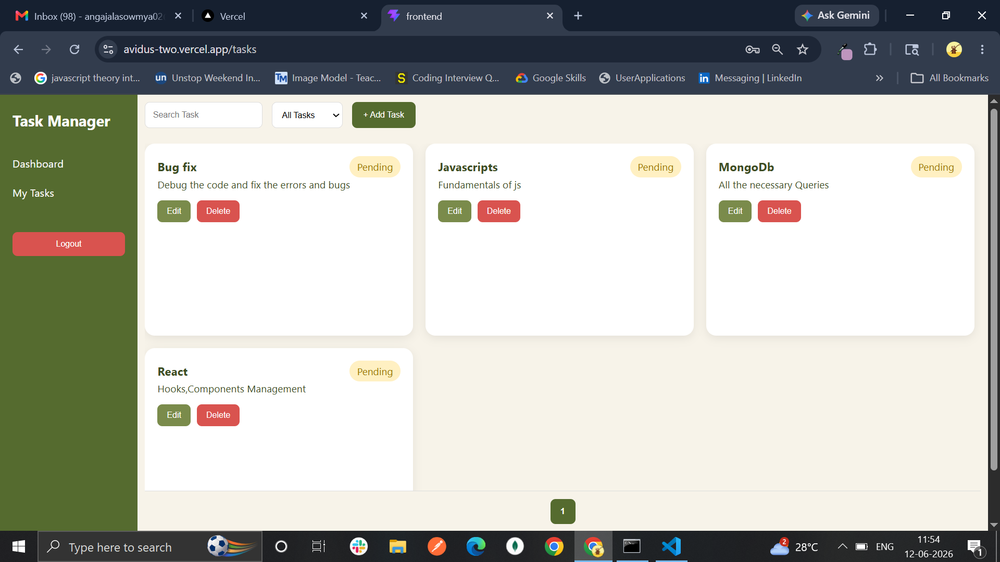
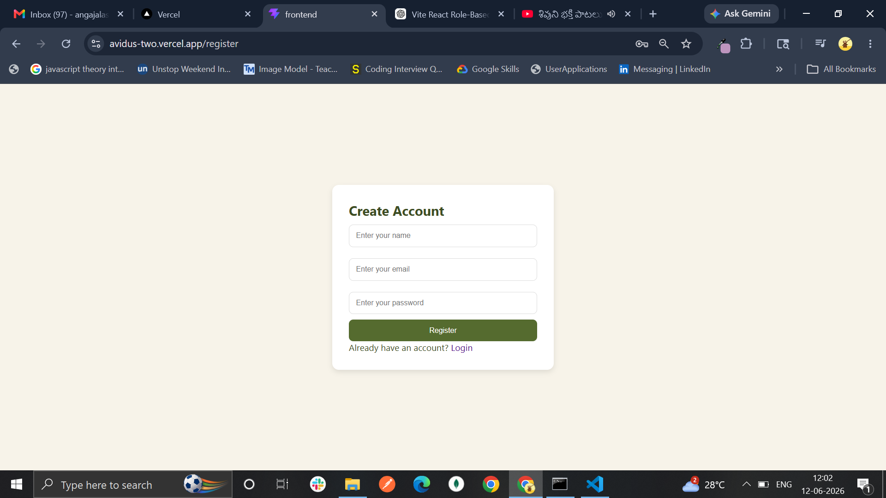

# Avidus
# Role-Based Task Management System

A full-stack Task Management System built using the MERN stack with Role-Based Access Control (RBAC), Activity Logging, Analytics Dashboard, JWT Authentication, and Admin Management features.

---

# Project Overview

This application allows users to manage their tasks efficiently while providing administrators with tools to monitor users, tasks, activities, and system analytics.

The system supports:

* User Registration & Login
* JWT Authentication
* Role-Based Authorization
* Task CRUD Operations
* Activity Tracking
* Admin Dashboard
* User Management
* Analytics Dashboard
* Responsive Design

---

# Tech Stack

## Frontend

* React.js
* Vite
* React Router DOM
* Axios
* Recharts
* Context API
* CSS3 (Custom Responsive Styling)

## Backend

* Node.js
* Express.js
* MongoDB Atlas
* Mongoose
* JWT Authentication
* bcryptjs
* Morgan
* CORS

## Database

* MongoDB Atlas

---

# Features

## Authentication

* User Registration
* User Login
* JWT Token Authentication
* Protected Routes
* Role-Based Access Control

---

## User Features

* Create Task
* View Own Tasks
* Update Own Tasks
* Delete Own Tasks
* Search Tasks
* Filter Tasks
* Pagination
* Responsive Dashboard

---

## Admin Features

* View All Users
* Delete Users
* Activate / Deactivate Users
* View All Tasks
* Delete Any Task
* View Activity Logs
* Analytics Dashboard

---

## Activity Logging

Tracks:

* User Login
* Task Creation
* Task Update
* Task Deletion

---

## Analytics

Displays:

* Total Users
* Total Tasks
* Completed Tasks
* Pending Tasks

Using:

* Pie Charts
* Bar Charts

---

# Folder Structure

## Backend

backend/
│
├── config/
│ └── db.js
│
├── controllers/
│ ├── authController.js
│ ├── taskController.js
│ └── adminController.js
│
├── middleware/
│ ├── authMiddleware.js
│ ├── adminMiddleware.js
│ └── taskOwnerMiddleware.js
│
├── models/
│ ├── User.js
│ ├── Task.js
│ └── ActivityLog.js
│
├── routes/
│ ├── authRoutes.js
│ ├── taskRoutes.js
│ └── adminRoutes.js
│
├── .env
├── package.json
└── server.js

---

## Frontend

frontend/
│
├── src/
│
├── api/
│ └── axios.js
│
├── components/
│ ├── Modal.jsx
│ ├── Pagination.jsx
│ ├── Sidebar.jsx
│ ├── StatsCard.jsx
│ ├── TaskCard.jsx
│ └── TaskForm.jsx
│
├── context/
│ ├── AuthContext.jsx
│ └── ToastContext.jsx
│
├── layouts/
│ └── DashboardLayout.jsx
│
├── pages/
│ ├── Home.jsx
│ ├── Login.jsx
│ ├── Register.jsx
│ ├── Dashboard.jsx
│ ├── MyTasks.jsx
│ ├── AdminUsers.jsx
│ ├── AdminTasks.jsx
│ ├── ActivityLogs.jsx
│ └── Analytics.jsx
│
├── routes/
│ ├── ProtectedRoute.jsx
│ └── AdminRoute.jsx
│
├── styles/
│ └── global.css
│
├── App.jsx
├── main.jsx
└── index.css

---

# Database Schema

## User Schema

Fields:

* name
* email
* password
* role
* status

Role Values:

* Admin
* User

Status Values:

* Active
* Inactive

---

## Task Schema

Fields:

* title
* description
* status
* createdBy

Status Values:

* Pending
* Completed

---

## Activity Log Schema

Fields:

* user
* action
* details
* createdAt

---

# API Endpoints

## Authentication

POST /api/auth/register

Register a new user

POST /api/auth/login

Login user

---

## Tasks

POST /api/tasks

Create task

GET /api/tasks

Get logged-in user's tasks

PUT /api/tasks/:id

Update task

DELETE /api/tasks/:id

Delete task

---

## Admin

GET /api/admin/users

Get all users

DELETE /api/admin/users/:id

Delete user

PATCH /api/admin/users/:id/status

Update user status

GET /api/admin/tasks

Get all tasks

DELETE /api/admin/tasks/:id

Delete any task

GET /api/admin/logs

Get activity logs

GET /api/admin/analytics

Get analytics data

---

# Installation

## Clone Repository

git clone repository-url

cd project-folder

---

# Backend Setup

cd backend

Install dependencies

npm install

Start backend

npm start

Server runs on:

http://localhost:5000

---

# Frontend Setup

cd frontend

Install dependencies

npm install

Start frontend

npm run dev

Frontend runs on:

http://localhost:5173

---

# Frontend Dependencies

npm install axios react-router-dom recharts

---

# Backend Dependencies

npm install express mongoose cors dotenv bcryptjs jsonwebtoken morgan

npm install nodemon --save-dev

---
## Home Page

## Login Page

## Tasks

## Register page

# Role-Based Access

## User

Can:

* Create Tasks
* View Own Tasks
* Update Own Tasks
* Delete Own Tasks

Cannot:

* Access Admin Routes
* Manage Other Users

---

## Admin

Can:

* Manage Users
* Manage Tasks
* View Analytics
* View Activity Logs
* Delete Any Task

---

# Responsive Design

Implemented using:

* CSS Grid
* Flexbox
* Media Queries

Supports:

* Mobile Devices
* Tablets
* Laptops
* Desktop Screens

---

# Theme

Color Palette:

Cream

#F7F3E9

Olive Green

#556B2F

Dark Olive

#3D4D23

White

#FFFFFF

---

# Future Enhancements

* Dark Mode
* Email Notifications
* Task Deadlines
* Task Priority Levels
* Profile Management
* Real-Time Notifications
* Export Reports

---

# Author

Sowmya Angajala

MERN Stack Developer
